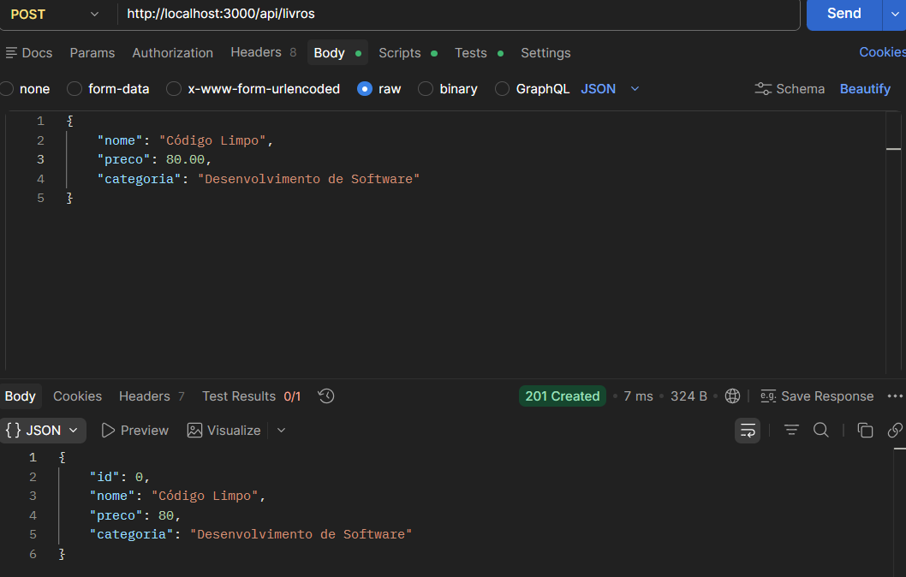
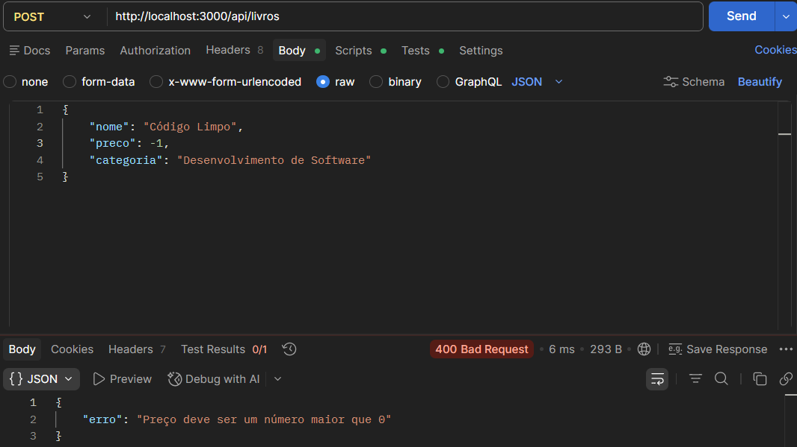
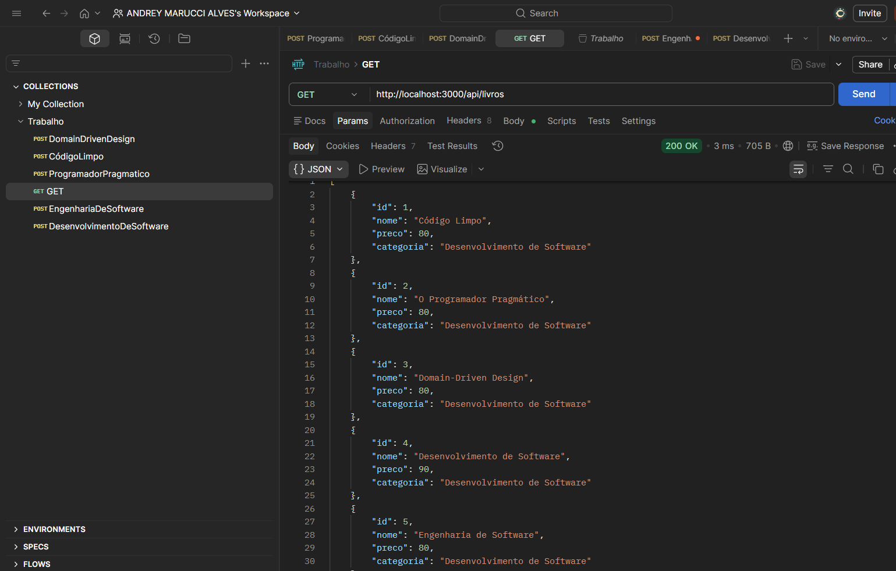

# 📚 API de Catálogo de Livros - Trabalho 1

Este projeto é uma API RESTful desenvolvida para o **Trabalho 1** da disciplina. O objetivo é gerenciar um catálogo de livros, permitindo o cadastro (POST) e a listagem (GET) com validações robustas.

---

## 🚀 Tecnologias Utilizadas

* **Node.js**
* **Express.js**
* **Postman** (Para testes e documentação)

---

## ⚙️ Como Executar o Projeto

1.  Clone este repositório.
2.  Abra o terminal na pasta do projeto.
3.  Instale as dependências:
    ```bash
    npm install
    ```
4.  Inicie o servidor:
    ```bash
    node index.js
    ```
5.  A API estará rodando em `http://localhost:3000`.

---

## 🛠️ Documentação dos Endpoints

### 1. Listar Todos os Livros
Retorna a lista de todos os livros cadastrados na memória.

* **Método:** `GET`
* **URL:** `/api/livros`
* **Resposta de Sucesso:**
    * **Código:** 200 OK
    * **Corpo:** Array de objetos contendo `id`, `nome`, `preco` e `categoria`.

---

### 2. Cadastrar Novo Livro
Realiza o cadastro de um livro após passar pelas validações de segurança e regras de negócio.

* **Método:** `POST`
* **URL:** `/api/livros`
* **Body (JSON):**
    ```json
    {
      "nome": "Código Limpo",
      "preco": 80.00,
      "categoria": "Desenvolvimento de Software"
    }
    ```
* **Respostas:**
    * **201 Created:** Sucesso ao cadastrar.
    * **400 Bad Request:** Erro de validação, campos vazios ou tipos incorretos.
    * **409 Conflict:** Livro com o mesmo nome já cadastrado.

---

## ✅ Validações Implementadas

Para garantir a integridade dos dados, a API conta com as seguintes regras:

1.  **Campos Obrigatórios:** Verifica se `nome`, `preco` e `categoria` foram enviados.
2.  **Tipo de Dado:**
    * `nome` e `categoria` devem ser Strings.
    * `preco` deve ser um Número.
3.  **Tamanho Mínimo:** Nomes e categorias devem ter pelo menos 3 caracteres (evita nomes vazios ou sem sentido).
4.  **Regra de Negócio (Preço):** O preço deve ser obrigatoriamente maior que 0.
5.  **Duplicidade:** A API impede o cadastro de dois livros com o mesmo nome.

---

## 🧪 Testes no Postman

Abaixo, os exemplos de requisições realizadas para validar o funcionamento.

### Exemplo de Requisição (POST)


* **Print 01: Cadastro com Sucesso (Status 201)**
    * 
* **Print 02: Erro de Validação de Preço (Status 400)**
    * 
* **Print 03: Erro de Livro já Cadastrado (Status 409)**
    *  
* **Print 04: Listagem Geral (Status 200)**
    * 

---

## 📂 Recursos Criados (Massa de Dados)

Conforme solicitado, foram criados os seguintes recursos iniciais para teste da API via POST:

1.  **Código Limpo** - R$ 80.00 (Desenvolvimento de Softwar)
2.  **O Programador Pragmático** - R$ 80.00 (Desenvolvimento de Softwar)
3.  **Domain-Driven Design** - R$ 80.00 (Desenvolvimento de Softwar)
4.  **Desenvolvimento de Software** - R$ 90.00 (Desenvolvimento de Software)
5.  **Engenharia de Software** - R$ 80.00 (Desenvolvimento de Software)

---

## 📝 Entrega
* **Data:** 23/03/2026
* **Arquivos:** `index.js`, `package.json`, `README.md`, `Imagens_Teste_Postman`,`Trabalho1_Collection.postman_collection.json`.
